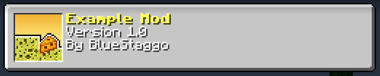
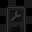
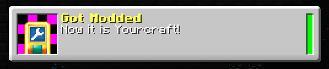

# Modding guide
This guide provides information on how to create modifications for Minecraft Diverge.


## Prerequisites:
- JDK 8 (more recent versions do not support modding) (preferrably downloaded from [Adoptium](https://adoptium.net/en-GB/temurin/releases/?version=8), the JDK used to compile Minecraft Diverge)
- RetroMCP 1.0.1 (https://github.com/MCPHackers/RetroMCP-Java; download 1.0.1 from the "Actions" tab, select the latest workflow, download the build artifacts and use the "GUI" jar if 1.0.1 has not released it)
- Minecraft Diverge's [patch file](merged.patch)
- Both the Minecraft Diverge [client](https://github.com/BlueStaggo/MCDiverge/releases/download/latest/mcdiverge.zip) and [server](https://github.com/BlueStaggo/MCDiverge/releases/download/latest/mcdiverge_server.zip)
- (Optional, but recommended) A Java IDE, like IntelliJ or Eclipse.

## Table of contents:
- [Chapter 1: Development environment](#chapter-1-development-environment)
    - [Setting up RetroMCP](#setting-up-retromcp)
    - [Decompiling Minecraft Diverge (or at least try to)](#decompiling-minecraft-diverge-or-at-least-try-to)
    - [Decompiling and patching Alpha v1.1.2_01](#decompiling-and-patching-alpha-v112_01)
    - [Recompiling and running Minecraft Diverge](#recompiling-and-running-minecraft-diverge)
- [Chapter 2: Basic mod development](#chapter-2-basic-mod-development)
    - [Loading the mod](#loading-the-mod)
    - [Adding mod content](#adding-mod-content)
    - [Publishing the mod](#publishing-the-mod)
    - [Additional resources](#further-resources)

# Chapter 1: Development environment

## Setting up RetroMCP
First, the RetroMCP jar needs to be placed in a new folder. Before decompiling, the `Side` in the `Options` menu needs to be set to `Merged`. Then, go to the "Current version" dropdown and select "Alpha 1.1.2_01". Upon being prompted to run the setup, click yes. RetroMCP will show up a notification when setup is completed, and at that stage RetroMCP should be closed. After this, in the directory RetroMCP is in, two folders called `minecraft` and `minecraft_server` need to be created with each containing a folder called `jars`, since RetroMCP does not create them automatically despite requiring them.

## Decompiling Minecraft Diverge (or at least try to)
In the `jars` folder (not in `minecraft` or `minecraft_server`), there should be a jar file for the client named `minecraft.jar` and a jar file for the server named `minecraft_server.jar`. Each jar needs to be opened in a file archiver and the contents of `mcdiverge.zip` and `mcdiverge_server.zip` need to be copied over to the respective jar. Make sure to delete META-INF in `minecraft.jar`, but not in `minecraft_server.jar`.

With Diverge ready to decompile, open up RetroMCP again and click on the `Decompile` button. Wait for it to do its work, however the decompilation will fail as there are many missing classes, duplicate members and missing generics. This is supposed to happen, as Minecraft Diverge has changed the source code so much that it is bound to have some major differences from the vanilla source code which RetroMCP cannot cope with. This is fine, as there is a different way to get Minecraft Diverge's source code that actually works.

## Decompiling and patching Alpha v1.1.2_01
Create a new folder and copy RetroMCP into it. Open up RetroMCP, set the side to merged, select "Alpha 1.1.2_01" as the current version and click "Decompile". Once decompilation is finished, create a `patches` folder, where the patch file for Minecraft Diverge needs to be moved into and named `merged.patch`. Back in RetroMCP, to the top left of the window, click on `MCP` > `More tasks...` > `Apply patch` to apply the patch file.

## Recompiling and running Minecraft Diverge
In the `minecraft_merged` folder, there is a `src` folder. This folder needs to be copied over to the `minecraft_merged` folder in the Minecraft Diverge decompilation after its `src` and `src_original` folders have been deleted. After that, the `src` folder needs to be copied as a new folder called `src_original`, so that RetroMCP will now use the fixed source code for recompiling as well as source code patch creation. Open up RetroMCP again and press the following buttons in this order while accepting any prompts that appear: `Recompile`, `Update MD5`, `Reobfuscate`, `Build`. After all of this, click `MCP` > `Launch client` and a decompiled version of Minecraft Diverge should be running!

# Chapter 2: Basic mod development

## Loading the mod
To start off creating a mod, add a new class in the folder `minecraft_merged/src/net/minecraft/src`. This class needs to inherit `BaseMod` and override the following methods:

```java
@Override // Name of the mod
public String getName() {
    return "Example Mod";
}

@Override // Mod version
public String getVersion() {
    return "v0.3_a4";
}

@Override // Author of the mod
public String getAuthor() {
    return "BlueStaggo";
}

@Override // Mod icon for mod list (optional)
public String getIcon() {
    return "/example_mod/icon.png";
}

@Override // Is the mod for the client or server? (defaults to both)
public ModSide getSide() {
    return ModSide.BOTH;
}

@Override // Load the actual mod
public void load() throws Exception {
    // Load your mod!
}
```

All resources are loaded relative to the first `src` folder, so if the mod class was used as the icon, its path would be `/net/minecraft/src/YourMod.class`. In the case above, relative to the RetroMCP jar, the icon would need to be stored in `/minecraft_merged/src/example_mod/icon.png`.

Upon running the game, however, the mod will not load. To force the mod to load, go to `ModLoader.java`, and before the code that loads the example mod, add in this code:

```java
// ...
        }
    }
}

// v v v
mods.add(new YourMod());
modCount++;
// ^ ^ ^

if (loadExampleMod) {
    mods.add(new ExampleMod());
    modCount++;
}
// ...
```

Make sure to remove this extra code before publishing the mod. If `ModLoader.class` appears in the final jar, it is safe to delete it.
To compile the code and run the game, click on `Recompile`, `Reobfuscate` and `Build` in RetroMCP. When the game is opened, check in the mods list and the mod should appear with its icon:



## Adding mod content
What should the mod do? One simple thing it can do is create an achievement and grant it to the player when the game loads. This is very trivial, as this is all the code that needs to be added in the mod:

```java
public static Achievement exampleAchievement;

@Override
public void load() {
    exampleAchievement = new Achievement("example_mod/got_modded", "Got Modded", "Now it is Yourcraft!")
            .setCreativeUnlockable();
    ModLoader.registry.addAchievement(exampleAchievement); // Make sure it is saved correctly
    if (ModLoader.isClient()) {
        Minecraft.getInstance().achievements.updateProgress(exampleAchievement, 1);
    }
}
```

As for the assets, relative to the src folder, these images need to be stored in the directory `/achievements/example_mod/` as `got_modded.png` and `got_modded_locked.png` respectively:

 

Now when the game is loaded this time, this should appear in the achievements menu:



## Publishing the mod
First, make sure the mod is not loaded from the ModLoader class. Like before, `Recompile`, `Reobfuscate` and `Build` in RetroMCP. In the `build` folder relative to the RetroMCP jar, two files can be found: `minecraft.zip` and `minecraft_server.zip`. Both of these files contain every class you have modified, but if there are any classes in there that you have not modified then make sure to delete them. Finally, the mod can be shared across the web, but one of the best places to share it in is in the Minecraft Diverge [Discord server](https://discord.gg/rzHsJkvpqw).

## Additional resources
This guide only shows so much, so looking through the [Example Mod](example_mod/net/minecraft/src/ExampleMod.java) and Minecraft Diverge's source code is recommended.
