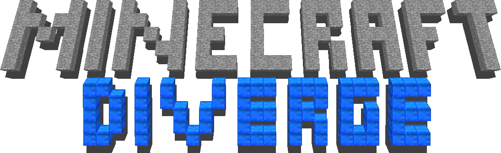
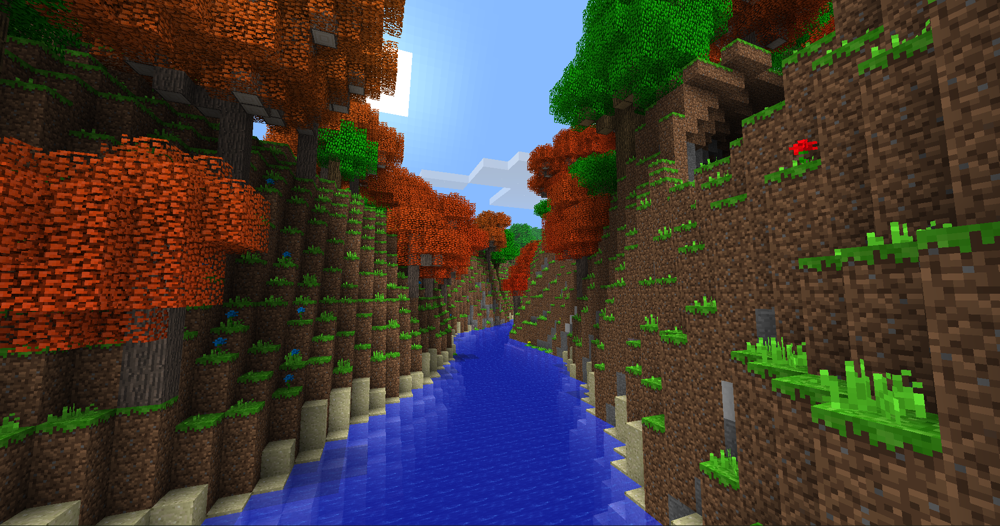
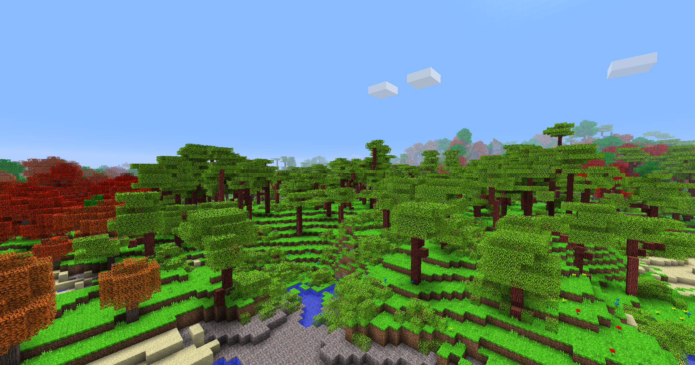
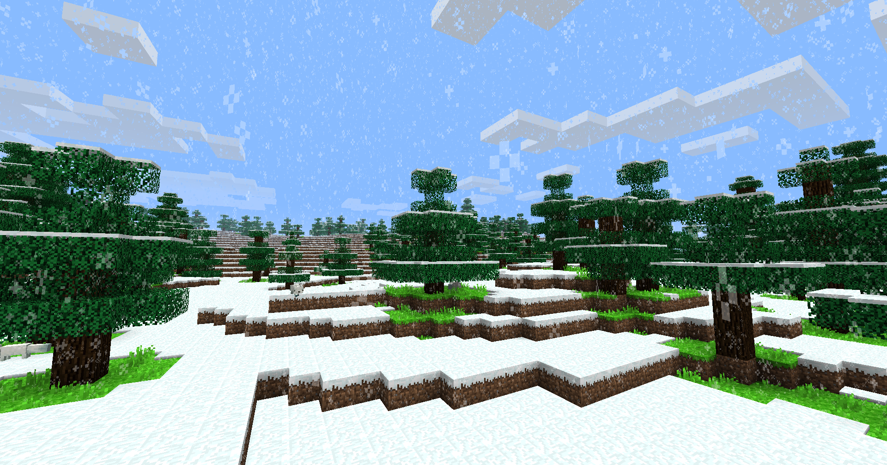
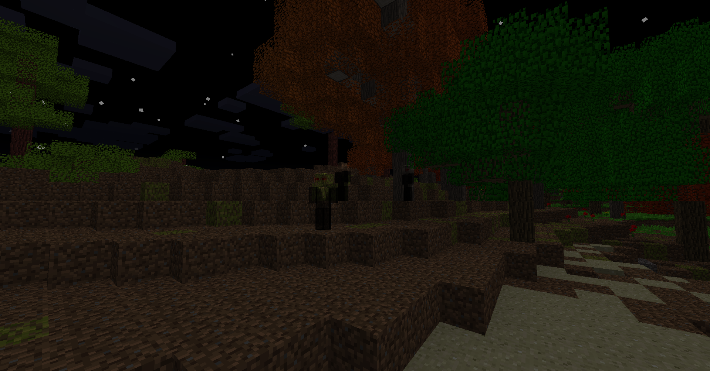
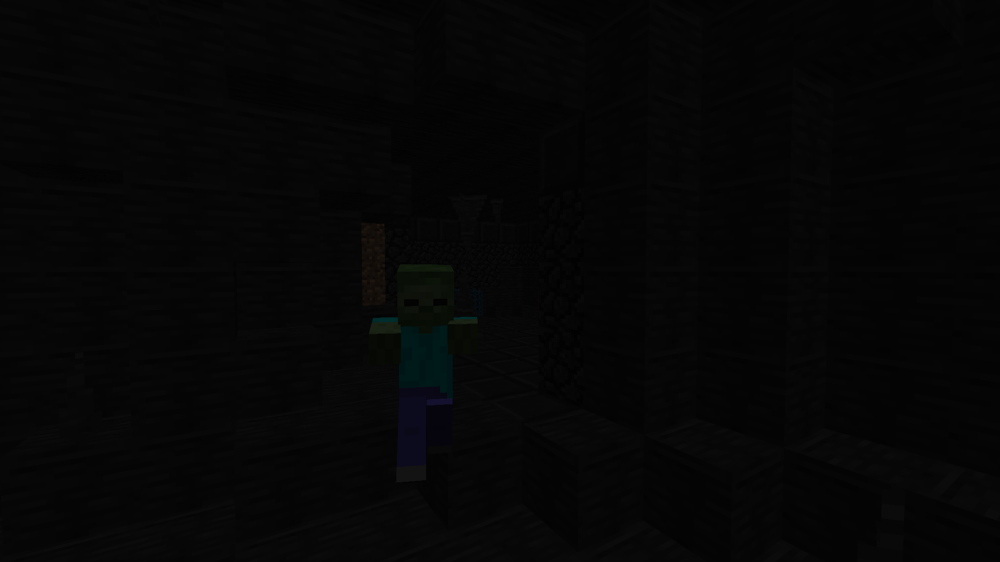
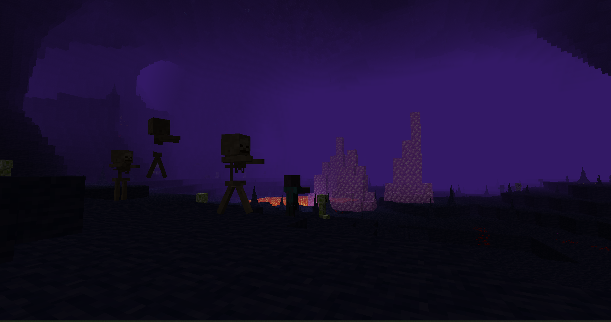

    

Minecraft Diverge is a Minecraft Alpha v1.1.2_01 mod that takes the game towards a different direction. Explore the new biomes, experiment with magic items and explore in a version of Minecraft, diverged! It provides fresh new world generation, extra content for the late game and plenty of tweaks.

For guidance with installing this mod, check out the [INSTALLATION](INSTALLATION.md) document. If you want to create mods for Diverge, check out the [MODDING](MODDING.md) guide.

This is the Github repository for Minecraft Diverge, where users can submit issues and download new versions. The source code for Minecraft Diverge is partially available in the form of patch files from RetroMCP-Java.

*Why don't you check out Minecraft Diverge's sister project, [Authentic Adventure](https://github.com/BlueStaggo/AuthenticAdventure)?*

## Features
- Stamina based sprinting
- Extended world height
- Six biomes with unique wood and stone types
- Rubies and sapphires, gems with magical properties
- Charms and trinkets that enhance your abilities
- Plenty of new blocks to build with
- New mobs: Foxes (the kind you voted for) and Phantoms (not the kind you voted for)
- A dangerous underworld found deep below with great treasures
- Creative mode, new world types and custom seeds
- Server side health, inventories and more
- Plenty of optimisations

## Trailer (Youtube)

## Screenshots

