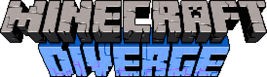

    

Minecraft Diverge is a Minecraft Beta 1.7.3 mod that will take the game towards a different direction. As this mod develops, explore new biomes, experiment with magic items and explore in a version of Minecraft, diverged! It will provide fresh new world generation, extra content for the late game and plenty of tweaks.

For guidance with installing this mod, check out the [INSTALLATION](INSTALLATION.md) document. Currently, the beta rework is in the alpha stage of development.

## Features
- Overhauled world generation
- Infinite world height
- Creative mode
- New and reworked mechanics and progression
- Plenty of building blocks
- Performance optimizations, predominantly from Smooth Beta and Starlight

## Trailer (Youtube)

## Known Major Bugs
- Tile entities randomly get removed when chunks are unloaded.
- Some sort of memory leak leads to the game crashing on a light blue screen. A workaround for this is to allocate more RAM (at least 4GB should do the trick)
